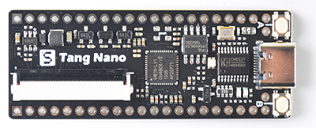
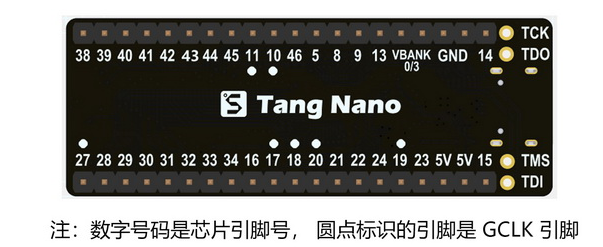
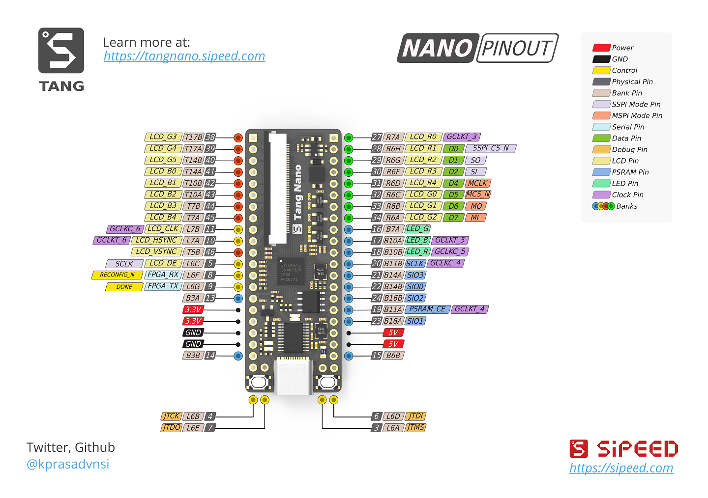

## 1. Introduction

Tang Nano is a core board designed based on [Gowin](https://www.gowinsemi.com/en/) GW1N-1 FPGA chip.The board is equipped with PSRAM, RGB LCD interface  and onboard USG-JTAG debugger, which make it convenient for users to  use.

## 2. Parameters

 **Note** :

- The Numeric number matches PIN number
- Numeric number with dot matches gclk pins

| Items             | Specs       |
| ----------------- | ----------- |
| Core              | GW1N-1 FPGA |
| Logic units(LUT4) | 1152        |
| Registers(FF)     | 864         |
| Block SRAM(bits)  | 72K         |
| B-SRAM block      | 4           |
| User flash(bits)  | 96K         |
| PLL               | 1           |
| I/O Bank          | 4           |
| I/O numbers       | 41          |
| Core quantity     | 1.2V        |
| Usb-Jtag          | ch552       |
| Onboard PSRAM     | 64Mbits     |

